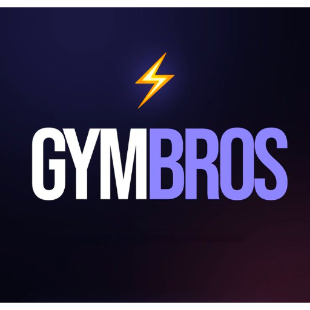

<p align="center">
  
</p>

<h1 align="center">⚡ GymBros</h1>
<p align="center"><em>Tu entrenamiento, inteligente.</em></p>

<p align="center">
  
  
  
  
</p>

---

## ¿Qué es GymBros?

GymBros es una **Progressive Web App (PWA)** para gestionar rutinas de entrenamiento de forma inteligente. Funciona offline, se instala en el celular como una app nativa y sincroniza los datos en la nube con Google OAuth.

Construida con **Vanilla JS + CSS puro** — sin frameworks, sin dependencias innecesarias. Bundle final < 150KB.

---

## Funcionalidades

### 🏋️ Rutinas
- Crear y editar rutinas con múltiples días (Lunes → Domingo + día CORE)
- Acordeón por día con estado persistente entre navegaciones
- Reordenar ejercicios con botones ▲▼
- Agregar / eliminar ejercicios y días desde la vista de detalle
- Editar series directamente desde el detalle de la rutina

### 💪 Ejercicios
- Base de datos de **60+ ejercicios** en 18 grupos musculares (español rioplatense)
- Instrucciones paso a paso por ejercicio (5 pasos cada uno)
- Figura anatómica SVG interactiva (frente / dorso) para seleccionar músculo
- Grupos especiales: **Core** y **Cardio** con ejercicios propios
- Búsqueda y filtros (todos / grupo / favoritos)
- Agregar ejercicios manuales personalizados
- Unidades por serie: **kg / min / seg** (ejercicios isométricos con SEG por defecto)

### 📊 Progreso
- Historial de sesiones por ejercicio
- Gráfico de área (peso máximo) + gráfico de barras (reps totales)
- Récords personales con indicador de tendencia ↑↓
- Tabla de historial con deltas por sesión

### ⏱ Entrenamiento
- **Cronómetro de sesión** con vueltas (split + acumulado)
- **Timer de descanso** entre series (configurable)
- Ambos accesibles desde la vista de la rutina

### 👤 Perfil
- Datos personales: nombre, edad, peso, altura, sexo
- Cálculo de IMC con categoría y color (Normal / Sobrepeso / Obesidad / Bajo peso)
- Foto de perfil desde Google
- Edición mediante modal centrado
- Toggle Light / Dark mode (detecta preferencia del sistema)

### ☁️ Sincronización
- **Login con Google OAuth** (Supabase Auth)
- Datos sincronizados en la nube: perfil, rutinas, historial, favoritos
- Funciona **offline** con localStorage como cache
- Multi-dispositivo: mismo login = mismos datos en cualquier dispositivo

---

## Stack tecnológico

| Capa | Tecnología |
|---|---|
| Frontend | HTML5 + CSS3 + Vanilla JS (ES2022) |
| Auth | Supabase Auth — Google OAuth 2.0 |
| Base de datos | Supabase (PostgreSQL) — 4 tablas con RLS |
| Hosting | Vercel |
| PWA | Service Worker + Web App Manifest |
| Fuentes | Sora + Bebas Neue (Google Fonts) |
| SDK | Supabase JS v2 (CDN) |

---

## Estructura del proyecto

```
gymbros/
├── index.html              # SPA — todas las pantallas
├── manifest.json           # PWA manifest
├── sw.js                   # Service Worker (cache offline)
├── css/
│   └── styles.css          # ~1100 líneas — diseño completo
├── js/
│   ├── app.js              # ~2500 líneas — lógica completa
│   └── supabase.js         # Cliente Supabase + helpers DB
└── icons/
    ├── favicon.svg
    ├── apple-touch-icon.svg
    ├── icon-192.png
    └── icon-512.png
```

---

## Base de datos (Supabase)

Ejecutar en el **SQL Editor** de Supabase:

```sql
create table profiles (
  user_id uuid primary key references auth.users(id) on delete cascade,
  data jsonb,
  updated_at timestamptz default now()
);
create table routines (
  user_id uuid primary key references auth.users(id) on delete cascade,
  data jsonb,
  updated_at timestamptz default now()
);
create table history (
  user_id uuid primary key references auth.users(id) on delete cascade,
  data jsonb,
  updated_at timestamptz default now()
);
create table favs (
  user_id uuid primary key references auth.users(id) on delete cascade,
  data jsonb,
  updated_at timestamptz default now()
);

-- Row Level Security
alter table profiles enable row level security;
alter table routines enable row level security;
alter table history  enable row level security;
alter table favs     enable row level security;

-- Policies (cada usuario solo ve sus propios datos)
create policy "own" on profiles for all using (auth.uid() = user_id);
create policy "own" on routines for all using (auth.uid() = user_id);
create policy "own" on history  for all using (auth.uid() = user_id);
create policy "own" on favs     for all using (auth.uid() = user_id);
```

---

## Variables de entorno / Configuración

En `js/supabase.js` reemplazar con los valores del proyecto:

```js
const SUPABASE_URL  = 'https://TU_PROJECT_ID.supabase.co';
const SUPABASE_ANON = 'TU_ANON_KEY';
```

---

## Correr localmente

No requiere build ni bundler.

```bash
# Clonar el repo
git clone https://github.com/neo81/GymBrosApp.git
cd GymBrosApp

# Servir con cualquier servidor estático
npx serve .
# o
python3 -m http.server 3000
```

Abrir `http://localhost:3000`

---

## Deploy en Vercel

```bash
# Instalar Vercel CLI
npm i -g vercel

# Deploy
vercel

# O conectar el repo en vercel.com para deploy automático en cada push
```

Agregar en Supabase → **Authentication → URL Configuration**:
- Site URL: `https://tu-app.vercel.app`
- Redirect URLs: `https://tu-app.vercel.app/**`

---

## Google OAuth — Configuración

1. [Google Cloud Console](https://console.cloud.google.com) → Crear proyecto → APIs → OAuth 2.0
2. **Orígenes JS autorizados:** `https://tu-app.vercel.app`
3. **URIs de redirección:** `https://TU_PROJECT_ID.supabase.co/auth/v1/callback`
4. Pegar Client ID y Secret en Supabase → Authentication → Providers → Google

---

## Flujo de datos

```
Usuario
  │
  ├─ Login Google OAuth
  │     └─ Supabase Auth → session token
  │
  ├─ Carga de datos
  │     └─ dbLoadAllUserData() → localStorage (cache)
  │
  ├─ Cambios (rutinas, perfil, etc.)
  │     └─ localStorage (inmediato) + Supabase (debounce 1.5s)
  │
  └─ Logout
        └─ pushLocalToCloud() → signOut() → clearLocalData()
```

---

## Pantallas

| Pantalla | Descripción |
|---|---|
| Welcome | Login con Google o uso sin cuenta |
| Registro | Formulario de perfil (nombre, edad, peso, altura, sexo) |
| Home | Saludo, stats, lista de rutinas |
| Nueva Rutina | Selector de días + ejercicios por día |
| Figura Anatómica | SVG interactivo para seleccionar músculo |
| Lista de Ejercicios | Grid con búsqueda, filtros y favoritos |
| Configurar Ejercicio | Series (reps + carga/tiempo), notas, unidad |
| Detalle Rutina | Acordeón por día, reordenar, editar, cronómetro |
| Perfil | Stats, IMC, foto de Google, edición modal, logout |
| Progreso | Gráficos AreaChart + BarChart por ejercicio |

---

## Licencia

MIT — libre para uso personal y comercial.

---

<p align="center">Hecho con 💪 por <a href="https://github.com/neo81">neo81</a></p>
